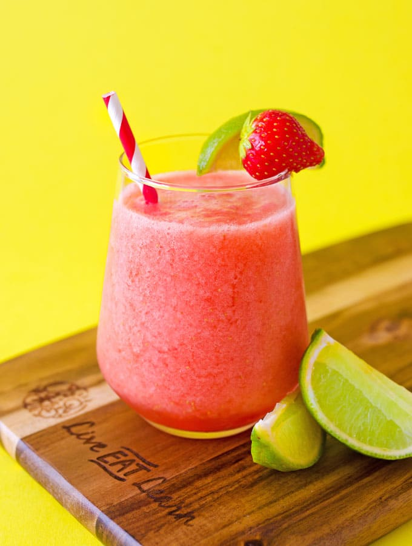

# Project 4
# A Nice Cold Beverage for the Hot Summer
 # About
 During the hot summer, I decided to make myself a strawberry limeade slushy in order to help he cool down.
 
 
  # Ingredients
  * 1/2 Lime ($0.49)
  * 1 1/2 cup of Strawberries ($2.99) (organic = $4.99)
  * 2 Tbsp of Sugar ($0.04/tbsp)
  * 1 cup of Water ($0.50)
  * Ice(as needed)

  # Directions
    1. Insert the strawberries, water, sugar, ice, and lime into the blender
    2. Liquify and serve!
    3. This step is optional, but you can strain the drink in order to remove any pulp or seeds from the strawberry
  # Where to Find these Ingredients
  * https://stopandshop.com/
  * https://www.shopmarketbasket.com/
  * https://www.target.com/
  * Any nearby supermarket
